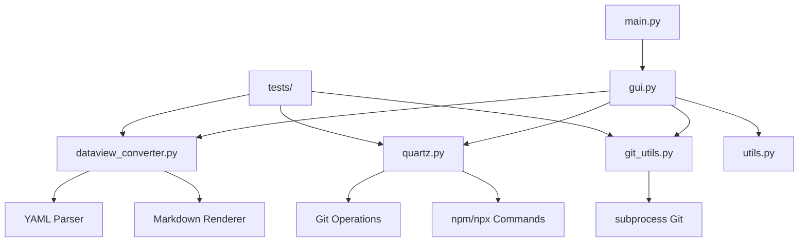

# Project Documentation

## Архитектура проекта

### Общий обзор

Проект представляет собой графическое приложение для автоматизации процесса публикации Obsidian заметок через Quartz static site generator. Архитектура построена на принципах разделения ответственности и модульности.

### Диаграмма архитектуры



### Компоненты системы

#### 1. GUI Layer (`gui.py`)
**Ответственность**: Пользовательский интерфейс и координация операций

**Ключевые классы**:
- `MainWindow` - главное окно приложения
- `WorkerThread` - асинхронная обработка операций

**Принципы**:
- Только UI логика, без бизнес-логики
- Асинхронная обработка через QThread
- Сигналы для обновления UI из фоновых потоков

#### 2. Dataview Converter (`dataview_converter.py`)
**Ответственность**: Парсинг и конвертация Dataview блоков

**Поддерживаемые операции**:
- `TABLE` запросы с колонками из frontmatter/inline полей
- `LIST` запросы с автоматическими ссылками
- Обработка `FROM` директив

**Ограничения**:
- Простые запросы без WHERE/SORT/GROUP
- Нет поддержки dataviewjs

#### 3. Quartz Integration (`quartz.py`)
**Ответственность**: Работа с Quartz static site generator

**Функции**:
- Клонирование/обновление Quartz репозитория
- Синхронизация контента из Obsidian Vault
- Запуск сборки через `npx quartz build`

#### 4. Git Utils (`git_utils.py`)
**Ответственность**: Git операции через subprocess

**Поддерживаемые операции**:
- `git clone`
- `git pull`
- `git commit`
- `git push`
- `git checkout`

#### 5. Utils (`utils.py`)
**Ответственность**: Вспомогательные функции

**Функции**:
- Создание директорий
- Общие утилиты

### Потоки данных

#### 1. Конвертация Dataview
```
Vault Files → dataview_converter → Static Markdown → Backup + Update
```

#### 2. Сборка Quartz
```
Vault → quartz.py → Quartz content/ → npx quartz build → public/
```

#### 3. Публикация
```
Quartz Directory → git_utils → Git Repository → Deployed Site
```

### Принципы проектирования

#### SOLID принципы
- **Single Responsibility**: Каждый модуль имеет одну ответственность
- **Open/Closed**: Модули открыты для расширения, закрыты для модификации
- **Liskov Substitution**: Интерфейсы совместимы
- **Interface Segregation**: Модули не зависят от неиспользуемых интерфейсов
- **Dependency Inversion**: Зависимости инвертированы через callback функции

#### Дополнительные принципы
- **DRY**: Избегание дублирования кода
- **KISS**: Простые и понятные решения
- **Separation of Concerns**: Разделение ответственности

### Тестирование

#### Unit Tests
- `tests/test_dataview_converter.py` - тесты конвертера
- Использование временных файлов для изоляции
- Mock объектов для внешних зависимостей

#### Интеграционные тесты
- Тестирование полного потока операций
- Проверка взаимодействия между модулями

### Расширяемость

#### Добавление новых типов Dataview
1. Расширить парсер в `dataview_converter.py`
2. Добавить новые renderer функции
3. Обновить тесты

#### Поддержка новых платформ
1. Создать новый модуль по образцу `quartz.py`
2. Реализовать интерфейс сборки
3. Интегрировать в GUI

#### Улучшение UI
1. Модифицировать `gui.py`
2. Сохранить архитектуру асинхронности
3. Добавить новые сигналы при необходимости

### Безопасность

#### Файловые операции
- Валидация путей
- Создание резервных копий
- Обработка ошибок доступа

#### Git операции
- Проверка статуса команд
- Обработка конфликтов
- Безопасные commit сообщения

### Производительность

#### Асинхронность
- Все длительные операции в фоновых потоках
- Неблокирующий UI
- Прогресс операций в реальном времени

#### Оптимизации
- Ленивая загрузка файлов
- Кэширование результатов парсинга
- Эффективная обработка больших vault'ов
